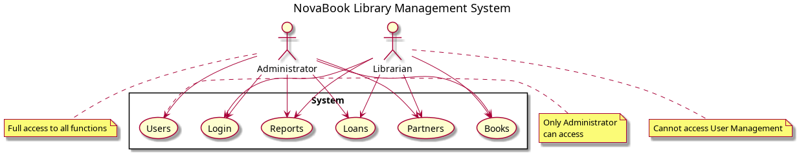
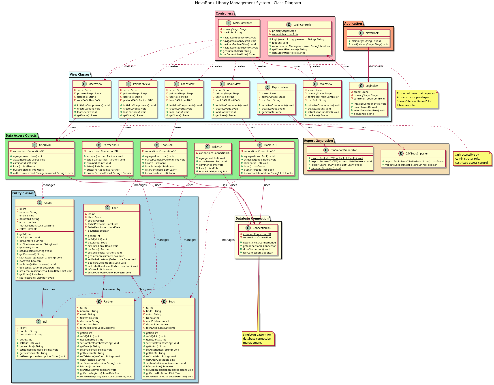

# NovaBook Library Management System

**Author**: Luis Alfredo  
**Clan**: Cienaga  
**Program**: Advanced Java + Spring Boot Route  
**Institution**: CodeUp  
**Project Type**: Library Management System with JavaFX GUI  
**Date**: October 2024

---

## 📋 Project Overview

NovaBook es un sistema completo de gestión de bibliotecas desarrollado en Java con JavaFX para la interfaz gráfica y MySQL para la persistencia de datos. El sistema implementa control de acceso basado en roles (RBAC) siguiendo el patrón arquitectónico Modelo-Vista-Controlador (MVC) junto con el patrón de diseño Objeto de Acceso a Datos (DAO).

### 🎯 Características del Sistema

- **Control de Acceso Basado en Roles**: Roles de Administrador y Bibliotecario con diferentes niveles de permisos
- **Gestión de Libros**: Operaciones CRUD completas para el inventario de la biblioteca
- **Gestión de Socios**: Registro y administración de miembros de la biblioteca
- **Gestión de Préstamos**: Procesamiento de préstamos y devoluciones de libros con seguimiento de vencimientos
- **Gestión de Usuarios**: Administración de usuarios del sistema (solo Administrador)
- **Importación/Exportación de Datos**: Funcionalidad CSV para migración de datos e informes

---

## 👥 Roles de Usuario y Permisos

### 👑 Rol de Administrador
**Acceso Completo al Sistema**
- ✅ Gestión de Libros (Crear, Leer, Actualizar, Eliminar)
- ✅ Gestión de Socios (Administración completa de miembros)
- ✅ Gestión de Préstamos (Procesamiento de préstamos y devoluciones)
- ✅ Gestión de Usuarios (Administración de usuarios del sistema)
- ✅ Operaciones de Importación/Exportación (Gestión de datos)

### 📚 Rol de Bibliotecario
**Acceso Limitado al Sistema**
- ✅ Gestión de Libros (Operaciones completas de libros)
- ✅ Gestión de Socios (Administración de miembros)
- ✅ Gestión de Préstamos (Préstamos y devoluciones)
- ✅ Operaciones de Importación/Exportación (Operaciones con datos)
- ❌ Gestión de Usuarios (Acceso Denegado - Solo para Administrador)

---

## 🏗️ Arquitectura del Sistema

### Patrones de Diseño Implementados

#### Modelo-Vista-Controlador (MVC)
- **Capa de Modelo**: Clases de entidad y lógica de negocio
- **Capa de Vista**: Componentes de interfaz de usuario JavaFX
- **Capa de Controlador**: Lógica de aplicación y control de navegación

#### Data Access Object (DAO)
- Operaciones centralizadas de base de datos
- Limpia separación de responsabilidades
- Gestión y pooling de conexiones

#### Patrón Singleton
- Gestión de conexiones a la base de datos
- Punto único de acceso para operaciones de base de datos

### 📊 Diagramas del Sistema

#### Diagrama de Casos de Uso


**Muestra:**
- Actores del sistema (Administrador, Bibliotecario)
- Casos de uso principales organizados por funcionalidad
- Restricciones de acceso basadas en roles
- Mecanismos de control de acceso

#### Diagrama de Clases


**Muestra:**
- Arquitectura MVC completa
- Relaciones y asociaciones entre entidades
- Implementación del patrón DAO
- Organización de Controladores y Vistas
- Gestión de conexiones a la base de datos

---

## 🔧 Stack Tecnológico

| Componente | Tecnología | Versión |
|------------|------------|---------|
| **Lenguaje** | Java | 11+ |
| **Framework GUI** | JavaFX | 17+ |
| **Base de Datos** | MySQL | 8.0+ |
| **Herramienta de Build** | Maven | 3.6+ |
| **Soporte IDE** | NetBeans | 15+ |
| **Testing** | JUnit 5 | 5.10.0 |
| **Cobertura de Código** | JaCoCo | 0.8.11 |
| **Logging** | java.util.logging | Built-in |
| **Configuración** | Properties files | Built-in |
| **Patrones de Diseño** | MVC, DAO, Singleton | - |

---

## 📁 Estructura del Proyecto

```
NovaBook/
├── src/
│   ├── main/
│   │   ├── java/com/codeup/novabook/
│   │   │   ├── App/
│   │   │   │   └── NovaBook.java                    # Punto de entrada de la aplicación
│   │   │   ├── Controllers/
│   │   │   │   ├── LoginController.java             # Lógica de autenticación
│   │   │   │   ├── MainController.java              # Navegación principal
│   │   │   │   ├── ReportsController.java           # Operaciones de importación/exportación
│   │   │   │   └── BookController.java              # Operaciones de libros
│   │   │   ├── Models/
│   │   │   │   ├── Entity/                          # Entidades de dominio
│   │   │   │   │   ├── Book.java                    # Entidad libro
│   │   │   │   │   ├── Partner.java                 # Entidad socio/miembro
│   │   │   │   │   ├── Users.java                   # Entidad usuario del sistema
│   │   │   │   │   ├── Loan.java                    # Entidad préstamo
│   │   │   │   │   └── Rol.java                     # Entidad rol de usuario
│   │   │   │   ├── DAO/                             # Objetos de acceso a datos
│   │   │   │   │   ├── BookDAO.java                 # Operaciones de datos de libros
│   │   │   │   │   ├── PartnerDAO.java              # Operaciones de datos de socios
│   │   │   │   │   ├── UserDAO.java                 # Operaciones de datos de usuarios
│   │   │   │   │   ├── LoanDAO.java                 # Operaciones de datos de préstamos
│   │   │   │   │   └── RolDAO.java                  # Operaciones de datos de roles
│   │   │   │   └── Connection/
│   │   │   │       └── ConnectionDB.java            # Gestión de conexión a la base de datos
│   │   │   ├── Utils/                               # Clases de utilidad
│   │   │   │   ├── ConfigManager.java               # Gestión de configuración
│   │   │   │   └── AppLogger.java                   # Logging de la aplicación
│   │   │   ├── Views/                               # Interfaz de usuario JavaFX
│   │   │   │   ├── LoginView.java                   # Interfaz de autenticación
│   │   │   │   ├── MainView.java                    # Interfaz de menú principal
│   │   │   │   ├── BooksView.java                   # Interfaz de gestión de libros
│   │   │   │   ├── PartnersView.java                # Interfaz de gestión de socios
│   │   │   │   ├── LoansView.java                   # Interfaz de gestión de préstamos
│   │   │   │   ├── UsersView.java                   # Interfaz de gestión de usuarios
│   │   │   │   ├── ReportsView.java                 # Interfaz de importación/exportación
│   │   │   │   ├── AdminDashboardView.java          # Dashboard de administrador
│   │   │   │   └── LibrarianDashboardView.java      # Dashboard de bibliotecario
│   │   │   └── Reports/
│   │   │       ├── CSVReportGenerator.java          # Funcionalidad de exportación de datos
│   │   │       └── CSVBookImporter.java             # Funcionalidad de importación de datos
│   │   └── resources/
│   │       └── config.properties                    # Configuración de la aplicación
│   └── test/java/com/codeup/novabook/
│       └── Models/Entity/
│           ├── BookTest.java                        # Tests de entidad Book
│           └── LoanTest.java                        # Tests de entidad Loan
├── database/                                # Scripts de base de datos
│   ├── schema.sql                          # Esquema de la base de datos con triggers
│   └── sample_data.sql                     # Datos de prueba para desarrollo
├── docs/                                   # Documentación
│   └── diagrams/                           # Diagramas UML
│       ├── use-case-diagram.png            # Diagrama de casos de uso
│       ├── use-case-diagram.puml           # Fuente PlantUML
│       ├── class-diagram.png               # Diagrama de clases
│       └── class-diagram.puml              # Fuente PlantUML
├── logs/                                   # Logs de la aplicación
│   └── app.log                             # Archivo de log principal
├── exports/                                # Archivos CSV exportados
├── jacoco-commands.sh                      # Script utilitario JaCoCo
├── pom.xml                                 # Configuración Maven
├── README.md                               # Documentación del proyecto
├── REQUIREMENTS_ANALYSIS.md                # Análisis de cumplimiento de requisitos
├── TESTING_DOCUMENTATION.md               # Documentación de pruebas JUnit 5
└── JACOCO_COVERAGE_REPORT.md               # Análisis de cobertura de código
```

---

## 🚀 Instalación y Configuración

### Requisitos Previos

```bash
- Java Development Kit (JDK) 17 o superior
- MySQL Server 8.0 o superior
- Maven 3.6 o superior
- JavaFX Runtime (incluido en OpenJDK 17+)
```

### Configuración de la Base de Datos

1. **Crear Base de Datos MySQL:**
   ```sql
   CREATE DATABASE Biblioteca CHARACTER SET utf8mb4 COLLATE utf8mb4_unicode_ci;
   ```

2. **Configurar Conexión a la Base de Datos:**
   - Editar `src/main/resources/config.properties`
   - Actualizar parámetros de conexión:
     ```properties
     database.url=jdbc:mysql://localhost:3306/Biblioteca
     database.username=root
     database.password=tu_contraseña
     database.driver=com.mysql.cj.jdbc.Driver
     ```

3. **Ejecutar Scripts de Base de Datos:**
   ```bash
   # Crear esquema de base de datos con triggers y procedimientos
   mysql -u root -p < database/schema.sql
   
   # Cargar datos de ejemplo para pruebas (opcional)
   mysql -u root -p < database/sample_data.sql
   ```

### Compilación y Ejecución

1. **Clonar/Descargar Proyecto:**
   ```bash
   cd /ruta/a/tu/workspace
   # El proyecto debería estar en: NovaBook/
   ```

2. **Compilar Proyecto:**
   ```bash
   cd NovaBook
   mvn clean compile
   
   # Empaquetar la aplicación
   mvn clean package
   ```

3. **Ejecutar Pruebas:**
   ```bash
   # Ejecutar todas las pruebas unitarias
   mvn test
   
   # Ejecutar clase de prueba específica
   mvn test -Dtest=BookTest
   mvn test -Dtest=LoanTest
   
   # Ejecutar pruebas con salida detallada
   mvn test -Dtest.output.detail=true
   
   # Limpiar y ejecutar todas las pruebas
   mvn clean test
   ```

4. **Cobertura de Código con JaCoCo:**
   ```bash
   # Ejecutar pruebas y generar informe de cobertura
   ./jacoco-commands.sh test
   
   # Ver resumen de cobertura en terminal
   ./jacoco-commands.sh summary
   
   # Abrir informe HTML de cobertura en navegador
   ./jacoco-commands.sh view
   
   # Generar informe solamente (sin ejecutar pruebas)
   ./jacoco-commands.sh report
   
   # Limpiar datos de cobertura
   ./jacoco-commands.sh clean
   ```

5. **Ejecutar Aplicación:**
   ```bash
   # Método principal usando plugin de JavaFX
   mvn javafx:run
   
   # Alternativa usando plugin exec
   mvn exec:java
   ```

### Cuentas de Usuario de Demostración

| Rol | Usuario | Contraseña | Descripción |
|------|----------|----------|-------------|
| **Administrador** | `admin` | `admin` | Acceso completo al sistema |
| **Bibliotecario** | `librarian` | `librarian` | Acceso limitado (sin gestión de usuarios) |

---

## 💻 Características del Sistema

### Sistema de Autenticación
- Login seguro con validación de roles
- Gestión de sesiones con seguimiento del usuario actual
- Adaptación de interfaz basada en roles
- Aplicación de control de acceso

### Gestión de Libros
- Agregar nuevos libros con información bibliográfica completa
- Editar detalles de libros existentes
- Eliminar libros del inventario
- Buscar libros por título, autor o ISBN
- Seguimiento del estado de disponibilidad
- Gestión de fecha de publicación

### Gestión de Socios
- Registrar nuevos miembros de la biblioteca
- Editar información de miembros
- Gestionar estado de miembros (activo/inactivo)
- Gestión de información de contacto
- Seguimiento de fecha de registro

### Gestión de Préstamos
- Crear nuevos préstamos de libros
- Procesar devoluciones de libros
- Seguimiento de fechas de préstamo y fechas de vencimiento
- Identificación de préstamos vencidos
- Gestión del historial de préstamos
- Búsqueda de registros de préstamos

### Importación/Exportación de Datos
- Exportar libros a formato CSV
- Exportar socios a formato CSV
- Exportar préstamos a formato CSV
- Importar libros desde archivos CSV
- Descargar plantillas CSV
- Validación de datos en importación

---

## 🔒 Características de Seguridad

### Control de Acceso Basado en Roles (RBAC)
- Sistema granular de permisos
- Adaptación de interfaz según rol de usuario
- Mecanismos de denegación de acceso para funciones restringidas
- Autenticación basada en sesión

### Validación de Datos
- Validación de entrada en todos los formularios
- Prevención de inyección SQL mediante prepared statements
- Aplicación de integridad de datos
- Manejo de errores y retroalimentación al usuario

---

## 📈 Mejoras Futuras

### Fase 2 - Migración a Spring Boot
- [ ] Interfaz web usando Spring Boot
- [ ] Implementación de API REST
- [ ] Autenticación JWT
- [ ] Migración de base de datos a JPA/Hibernate

### Fase 3 - Características Avanzadas
- [ ] Dashboard de reportes avanzados
- [ ] Notificaciones por email para libros vencidos
- [ ] Integración de escaneo de códigos de barras
- [ ] Soporte para múltiples bibliotecas
- [ ] Soporte para aplicación móvil

---

## 🛠️ Información de Desarrollo

### Dependencias Maven
```xml
<!-- MySQL Connector -->
<dependency>
    <groupId>mysql</groupId>
    <artifactId>mysql-connector-java</artifactId>
    <version>8.0.33</version>
</dependency>

<!-- Apache Commons DBCP -->
<dependency>
    <groupId>org.apache.commons</groupId>
    <artifactId>commons-dbcp2</artifactId>
    <version>2.12.0</version>
</dependency>

<!-- JavaFX Controls -->
<dependency>
    <groupId>org.openjfx</groupId>
    <artifactId>javafx-controls</artifactId>
    <version>19.0.2.1</version>
</dependency>

<!-- JUnit 5 Dependencies -->
<dependency>
    <groupId>org.junit.jupiter</groupId>
    <artifactId>junit-jupiter-engine</artifactId>
    <version>5.10.0</version>
    <scope>test</scope>
</dependency>
```

### Configuración de Compilación
```xml
<plugin>
    <groupId>org.apache.maven.plugins</groupId>
    <artifactId>maven-compiler-plugin</artifactId>
    <version>3.12.1</version>
    <configuration>
        <source>11</source>
        <target>11</target>
    </configuration>
</plugin>
```

---

## 📞 Información de Contacto

**Desarrollador**: Luis Alfredo  
**Clan**: Cienaga  
**Programa**: Advanced Java + Spring Boot Route  
**Institución**: CodeUp  

**Repositorio del Proyecto**: Entorno de Desarrollo Local  
**Entorno de Desarrollo**: Ubuntu Linux con NetBeans IDE  

---

## 📄 Licencia

Este proyecto es desarrollado como parte de la ruta de aprendizaje Advanced Java + Spring Boot de CodeUp.  
Solo para fines educativos.

---

## 🙏 Agradecimientos

- **Institución CodeUp** por proporcionar el marco de aprendizaje
- **Clan Cienaga** por el apoyo colaborativo
- **Comunidad Java** por la extensa documentación y recursos
- **Comunidad JavaFX** por el soporte del framework GUI

---

**Documentación Generada**: Octubre 2024  
**Diagramas PlantUML**: Documentación UML profesional  
**Total de Clases**: 27 clases Java implementando arquitectura MVC completa